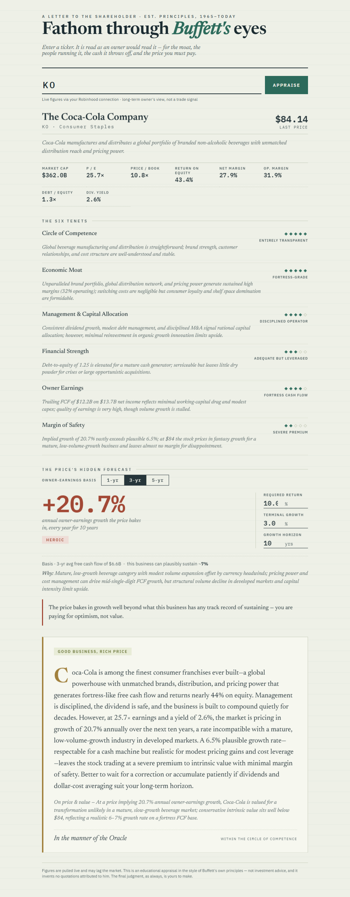

# Fathom

*Fathom through Buffett's eyes.*

Enter a ticker and get it read the way an owner would read it — moat, management, owner earnings, and a reverse-DCF that tells you what growth rate the current price is actually betting on, all judged against the framework distilled from Warren Buffett's Berkshire shareholder letters.

Repo: https://github.com/ripshy/fathom



## Setup

```sh
npm install
cp .env.example .env
# then set ANTHROPIC_API_KEY in .env
npm run dev
```

This starts the Vite dev server (`http://localhost:5173`) and a small Express proxy (`:8787`) that holds your Anthropic API key server-side — the browser never sees it.

Optional `.env` vars:
- `ROBINHOOD_MCP_TOKEN` — OAuth token for the hosted Robinhood MCP connector. Without it, figure-gathering falls back to web search.
- `COST_WARN_THRESHOLD` — logs a warning when a single API call is estimated to cost more than this (default `0.03`).

## How it works

Two Claude calls per appraisal, both on Haiku 4.5 to keep cost down:

1. **Gather** — pulls live fundamentals (price, market cap, margins, free cash flow history) for the ticker via Robinhood MCP or web search.
2. **Analyze** — judges the business against Buffett's six tenets (circle of competence, moat, management, financial strength, owner earnings, margin of safety) and writes the verdict letter.

A deterministic reverse-DCF (no LLM involved) solves for the annual owner-earnings growth rate the current price already implies, so the verdict can weigh that against a conservative, business-specific growth estimate.
